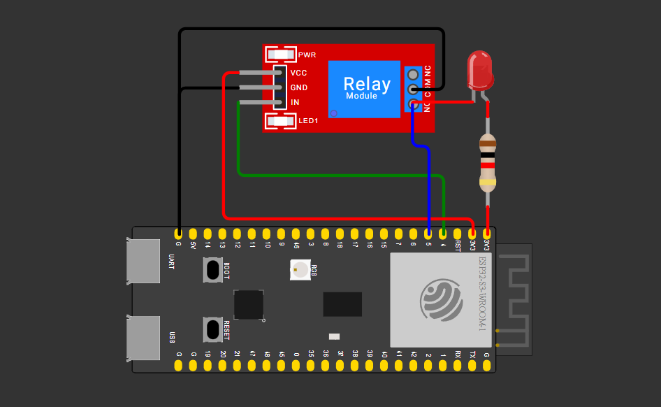

# Relay Response Time Measurement (ESP32)
 
Вимірювання часу спрацювання реле: інтервал між командою на увімкнення (`digitalWrite` на IN) та фактичним замиканням контакту (NO), зафіксованим апаратним перериванням.
 
## Схема підключення
 

 
| Сигнал | ESP32 пін | Реле-модуль | Колір проводу на схемі |
|---|---|---|---|
| Керування (IN) | GPIO 4 | IN | Зелений |
| Зчитування контакту | GPIO 5 | NO (через LED + резистор) | Синій |
| Живлення | 3V3 / GND | VCC / GND | Червоний/ Чорний |

 
Пін зчитування (`GPIO 5`, `INPUT_PULLUP`) підключений до нормально розімкнутого контакту (NO), який при спрацюванні реле замикає коло з LED-індикатором на `3V3`.
 
## Логіка вимірювання
 
1. Кожну секунду (`INTERVAL`) реле перемикається (ON/OFF) через `digitalWrite(RELAY_PIN_IN, ...)`, момент команди фіксується `micros()`.
2. Апаратне переривання (`attachInterrupt`, `RISING`) на `RELAY_PIN_OUT` фіксує момент фактичного замикання контакту.
3. ISR мінімальна — лише встановлює `volatile` прапорець і зберігає час; вся обробка — в `loop()`.
4. Різниця між моментом команди та моментом переривання — час відгуку реле для одного циклу.
5. Проводиться `MEASUREMENTS_COUNT` (10) вимірювань, результати зберігаються в масив, після чого в Serial Monitor виводяться всі результати та середнє значення.

## Отримані дані
 
```
==== Measurement start ====
Measurement 1: 1042 us
Measurement 2: 1042 us
Measurement 3: 1046 us
Measurement 4: 1054 us
Measurement 5: 1042 us
Measurement 6: 1005 us
Measurement 7: 1047 us
Measurement 8: 1046 us
Measurement 9: 1041 us
Measurement 10: 1044 us
Average: 1040 us
==== Measurement finish ====
```

 
