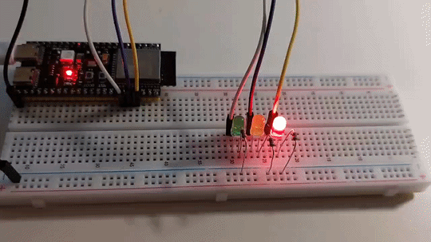

# ESP32 Поліцейська мигалка (Police Light)

Три звичайні світлодіоди (синій, червоний, зелений) відтворюють різні патерни блимання, що імітують поліцейську мигалку. Режими блимання перемикаються автоматично, а швидкість миготіння поступово зростає з кожним повним циклом режимів.

## Режими роботи

| № | Режим                 | Опис                                           |
|---|-----------------------|-------------------------------------------------|
| 0 | `TWO_LED_ONE_BLINK`   | Почергове блимання синім і червоним, по одному спалаху |
| 1 | `TWO_LED_TWO_BLINK`   | Почергове блимання синім і червоним, по два спалахи |
| 2 | `THREE_LED_ONE_BLINK` | По черзі блимають синій, зелений, червоний      |
