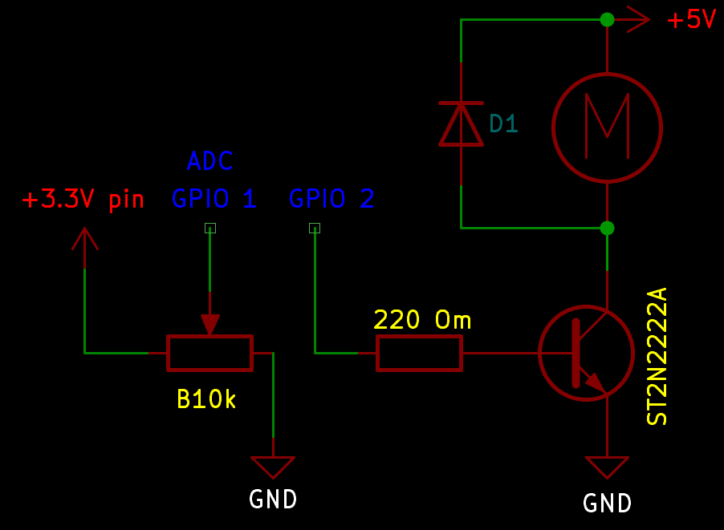

# Регулювання швидкості мотора потенціометром. 

PWM-сигнал формується вручну на `millis()`/`micros()` (без апаратного LEDC), керує транзистором 2N2222A, який комутує коло мотора.

## Схема підключення



| Сигнал | ESP32-S3 пін | Компонент |
|---|---|---|
| Зчитування потенціометра | GPIO 1 (ADC1) | Потенціометр B10k |
| Керування транзистором | GPIO 2 | База 2N2222A через резистор 220 Ом |


**Силове коло мотора** (не через GPIO):
```
Зовнішнє +5V → Мотор → Колектор 2N2222A → Емітер → GND (спільний з ESP32)
```

- Базовий резистор 220 Ом (розрахований під пусковий струм мотора ~200 мА).
- Flyback-діод паралельно мотору — гасить зворотний викид напруги при вимкненні.
- Живлення мотора — **окреме зовнішнє джерело**, спільна лише земля (GND) з ESP32.

## Логіка роботи

1. Кожні `READ_INTERVAL` (20 мс) зчитується потенціометр (`analogRead`, 0-4095 на ESP32) і перетворюється (`map()`) у тривалість `onTime` — частку періоду PWM, коли сигнал `HIGH`.
2. Незалежно, у кожній ітерації `loop()`, порівнюється поточний `micros()` з початком поточного PWM-періоду — формується сам сигнал (`digitalWrite HIGH`/`LOW`).
3. Частота PWM — **10 кГц** (`PWM_PERIOD = 100` мкс).
4. Без `delay()` — увесь таймінг на порівнянні збережених міток часу, `loop()` не блокується.

## Виявлені проблеми під час налагодження

- **Нестабільний старт мотора** ("через раз", "стукає замість обертання") виявився пов'язаний із **живленням**, а не з кодом чи частотою PWM — заміна кабелю живлення вирішила проблему повністю.

