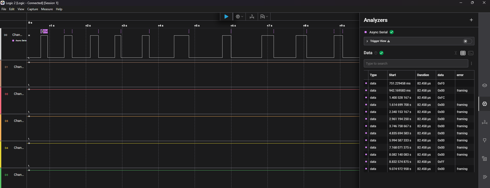
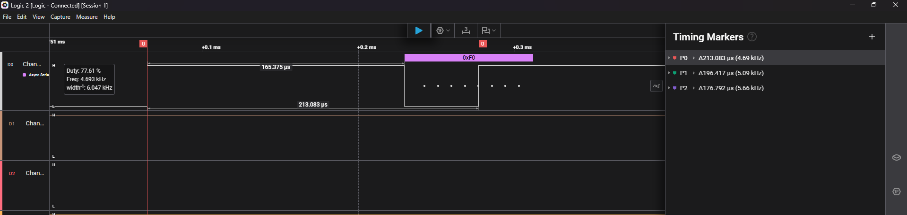

## Вимірювання дребезгу контактів (button debounce)

### Обладнання
- Логічний аналізатор, сумісний з Saleae Logic (8 каналів, 24 МГц)
- ПЗ: Logic 2
- Кнопка підключена на GPIO з підтяжкою (pull-up), канал D0 аналізатора підʼєднано паралельно до GPIO

### Методика вимірювання
1. Кнопку натиснуто 10 разів з різною швидкістю та силою натискання.
2. Кожне натискання записано логічним аналізатором.
3. Для кожного запису перевірено форму сигналу на предмет дребезгу.

### Результати
Виявлено 3 випадки як аналізатором так мікроконтролером. 
Аналізатор виявив при 1,2 та 10 натисканні.
| №  | Швидкість/сила | Дребезг | Кількість імпульсів | Тривалість брязкоту |
|----|----------------|---------|---------------------|---------------------|
| 1  | швидко/сильно  | так     | 1                   | 213.083 µs          |
| 2  | швидко/сильно  | так     | 1                   | 196.417 µs          |
| 10 | повільно/слабко| так     | 1                   | 176.792 µs          |

### Висновок
З 10 натискань дребезг чітко спостерігався лише у 3 випадках (30%) як аналізатором так і мікроконтролером, решта 7 натискань дали чистий перепад сигналу без помітного дребезгу. 
Механічний дребезг проявляється не завжди, а частіше при швидкому/сильному натисканні.
Після додавання керамічного конденсатора на 0.1 мкФ в схему аналізатор перестав виявляти брязкіт. Виявлення брязкоту мікроконтролером зменшилось до 10%.
